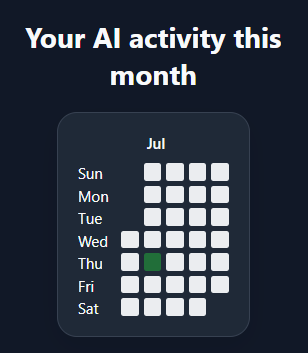

# AI Footprints - Track AI site usage

A Chrome extension that tracks and visualizes your AI tool usage through an interactive dashboard and GitHub-style activity heatmap.



## Features

- Track visits to AI platforms automatically
- View daily and monthly AI usage statistics
- GitHub-style activity heatmap visualization
- Local data storage for privacy
- Real-time usage updates
- Clean and responsive user interface

## Tech Stack

- Vue 3
- JavaScript
- Chrome Extensions API (Manifest V3)
- Bootstrap
- Local Storage API

## Installation

1. Clone the repository:

```bash
git clone https://github.com/withhloveee/ai-activity-extension.git
```

2. Install dependencies:

```bash
npm install
```

3. Build the extension:

```bash
npm run build
```

4. Open Chrome and navigate to:

```
chrome://extensions
```

5. Enable **Developer Mode**.

6. Click **Load unpacked** and select the generated build directory.

## How It Works

The extension monitors visits to supported AI platforms and stores activity data locally in the browser. The collected data is then aggregated and displayed through usage statistics and a contribution-style heatmap, helping users understand their AI usage patterns over time.

## Privacy

All activity data is stored locally on the user's device. No data is transmitted to external servers.

## Future Improvements

- Weekly and yearly analytics
- Export usage reports
- Goal tracking and productivity metrics
- Cross-device synchronization
- Support for additional AI platforms